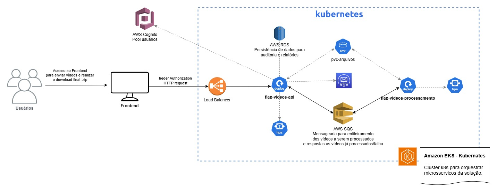

# Fiap Video API


API para upload, processamento e download(.zip com prints/frames dos vídeos processados) de vídeos .mp4.



> Diagrama de arquitetura elaborado.

## ⚙️ Tecnologias
O ambiente de desenvolvimento emprega múltiplas bibliotecas que visam otimizar a produtividade e garantir a qualidade do código. Entre elas, destacam-se:

- [AWS SDK Cognito Identity Provider](https://github.com/aws/aws-sdk-js-v3): Biblioteca para integração com o Amazon Cognito. 
- [AWS SDK SES](https://github.com/aws/aws-sdk-js-v3): Cliente para o Amazon Simple Email Service (SES).
- [AWS SDK SQS](https://github.com/aws/aws-sdk-js-v3): Cliente para o Amazon Simple Queue Service (SQS).
- [AWS SDK Credential Providers](https://github.com/aws/aws-sdk-js-v3): Gerenciadores de credenciais para AWS SDK.
- [NestJS](https://nestjs.com/): Framework para construção de aplicações Node.js escaláveis.
- [Axios](https://axios-http.com/): Cliente HTTP baseado em Promises.
- [Multer](https://github.com/expressjs/multer): Middleware para upload de arquivos no Express.
- [MySQL2](https://github.com/sidorares/node-mysql2): Cliente MySQL para Node.js.
- [TypeORM](https://typeorm.io/): ORM para Node.js baseado em TypeScript e JavaScript.
- [Jest](https://jestjs.io/): Framework de testes em JavaScript com suporte a mocks, snapshots e cobertura de código.

## 💻 Pré-requisitos

Antes de começar, verifique se você atendeu aos seguintes requisitos:

### Startando SQS na maquina local para teste
Para executar o SQS local basta utilizar docker compose, para isso execute o comando:

```
docker compose up localstack
```

Após subir o container docker para SQS, basta configurar aws cli, conforme roteiro oficial citado logo abaixo, e depois executar os comandos para criar as filas:

```
aws sqs create-queue --queue-name=processar --profile localstack --endpoint-url=http://localhost:4566
aws sqs create-queue --queue-name=processados --profile localstack --endpoint-url=http://localhost:4566
```

Roteiro oficial utilizado como guia:
https://docs.quarkiverse.io/quarkus-amazon-services/dev/amazon-sqs.html#_provision_sqs_locally_manually

### Configurando SES local
Para executar o SES local basta utilizar docker compose, para isso execute o comando:

```
docker compose up localstack
```

Após subir o container docker para SES, basta configurar aws cli, conforme roteiro oficial citado acima, e depois executar os comandos:

```
aws ses verify-domain-identity --domain example.com --endpoint-url=http://localhost:4566
aws ses verify-email-identity --email-address sender@example.com --endpoint-url=http://localhost:4566
```

### Configurando Cognito local
No LocalStack Community (versão gratuita), muitas operações relacionadas ao Cognito (incluindo a criação de User Pools) não estão implementadas, por esse motivo é necessário conectar ao cognito real.

Defina AWS_COGNITO_PERMIT_ALL=true no .env para testar localmente sem precisar gerar um jwt valido.

## 🚀 Instalando o Projeto

Para instalar o fiap-video-api, siga estas etapas:

```bash
$ npm install
```

Para iniciar o fiap-video-api, siga estas etapas:

```bash
# development
$ npm run start

# watch mode
$ npm run start:dev

# production mode
$ npm run start:prod
```

Para executar os testes, utilize os seguintes comandos:

```bash
# unit tests
$ npm run test

# e2e tests
$ npm run test:e2e

# test coverage
$ npm run test:cov
```